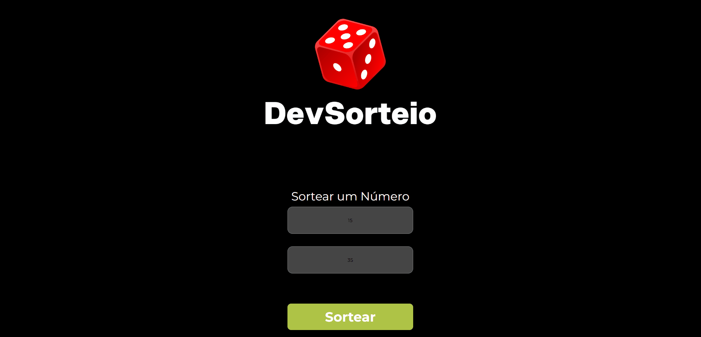

# 🎲 Sorteador Online

Um projeto simples e responsivo para gerar números aleatórios entre um valor mínimo e um valor máximo.

Desenvolvido como projeto de estudo para praticar HTML, CSS e JavaScript.

---

## 🚀 Demonstração

🔗 **Acesse o projeto:**  
> (Adicionar o link do GitHub Pages após a publicação)

---

## 📸 Preview

> Adicione aqui uma captura de tela do projeto.

Exemplo:



---

## 🛠️ Tecnologias utilizadas

- HTML5
- CSS3
- JavaScript (ES6)

---

## ✨ Funcionalidades

- Escolha um número mínimo.
- Escolha um número máximo.
- Geração de número aleatório.
- Validação de campos vazios.
- Validação para impedir que o valor mínimo seja maior ou igual ao máximo.
- Layout responsivo.

---

## 📚 Aprendizados

Durante o desenvolvimento deste projeto, pratiquei conceitos como:

- Estrutura semântica em HTML5;
- Responsividade utilizando CSS;
- Manipulação do DOM;
- Eventos com `addEventListener`;
- Validação de dados;
- Geração de números aleatórios utilizando `Math.random()`.

---

## 📂 Como executar

Clone este repositório:

```bash
git clone https://github.com/SEU-USUARIO/sorteador-online.git
```

Depois abra o arquivo `index.html` em seu navegador.

---

## 👨‍💻 Autor

**Wellington dos Reis Carvalho**

GitHub:
https://github.com/Wellrx